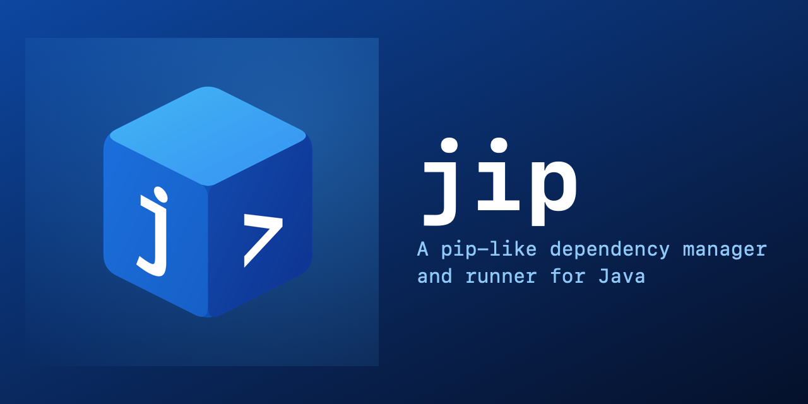

<div align="center">

  

  <h1>jip</h1>

  A pip-like dependency manager and runner for Java — clone it. Run it. Done.
  Clone a project, run it — jip handles dependencies, compilation, and execution
  in a single binary with a single slim config file.

  
  
  

  <br><br>
  <a href="#quick-start">Quick Start</a> ·
  <a href="#commands">Commands</a> ·
  <a href="#configuration">Configuration</a> ·
  <a href="#maven--gradle-conversion">Conversion</a> ·
  <a href="#license">License</a>
</div>

## Features

- **Single binary** — no JVM plugins, no daemon, no global config. Download and run.
- **Dependency resolution** from Maven Central and custom repositories (including local `file://` repos)
- **Lock file** (`jip.lock`) pins every dependency for reproducible builds
- **Three dependency scopes** — runtime, compile-only (`provided`), and test
- **Maven & Gradle conversion** — `jip init` detects existing projects and offers to convert `pom.xml` / `build.gradle` into `jip.toml`
- **Lazy classpath** — dependencies are downloaded on first use, not upfront
- **Auto-detect main class** — finds `public static void main` or lets you pick interactively
- **Smart argument handling** — `jip run start` passes `start` as a program argument, not a class name
- **JVM system properties** — `-DNAME=VALUE` pass-through without `-cp` handling
- **Thin & fat JARs** — `jip jar` for project-only, `jip jar --fat` with all dependencies merged
- **JUnit test runner** — compiles and executes tests via the JUnit Platform Console Launcher
- **M2 cache reuse** — optionally uses `~/.m2/repository` jars instead of re-downloading
- **Dependency tree** — compact view of resolved dependencies
- **Upkeep commands** — `jip list`, `jip outdated`, `jip update [<dep>]`, `jip clean`, and `jip completion <shell>` keep projects tidy
- **BOM / platform support** — Maven `<scope>import</scope>` BOMs and Gradle `platform()` / `enforcedPlatform()` are resolved during conversion
- **Gradle version catalogs** — `gradle/libs.versions.toml` `[libraries]` + `[versions]` are resolved automatically

## Quick Start

```bash
# Initialize a new project
jip init

# Add a dependency
jip add com.google.guava:guava:33.0.0-jre

# Run it
jip run
```

### Clone and run a Maven/Gradle project

```bash
git clone https://github.com/example/app.git
cd app
jip run    # detects pom.xml / build.gradle, offers conversion, downloads deps, runs
```

### From an existing Maven project

```bash
cd my-maven-project
jip init           # converts pom.xml → jip.toml + jip.lock
jip run            # runs with the converted dependencies
```

## Commands

| Command | Description |
|---------|-------------|
| `jip init` | Create `jip.toml`, converting Maven/Gradle if detected |
| `jip add <dep>` | Add a dependency (`group:artifact:version`) |
| `jip remove <dep>` | Remove a dependency |
| `jip resolve` | Re-resolve all dependencies and write `jip.lock` |
| `jip build` | Compile sources into `target/classes` |
| `jip run` | Run the project's main class |
| `jip jar` | Package into `target/app.jar` |
| `jip jar --fat` | Package into `target/app-fat.jar` (all dependencies merged) |
| `jip test` | Compile and run JUnit tests |
| `jip search <query>` | Search Maven Central |
| `jip tree` | Show the resolved dependency tree |
| `jip list` | List all resolved dependencies with versions |
| `jip outdated` | Show which dependencies have newer versions (read-only) |
| `jip update [<dep>]` | Bump one or all dependencies to their latest versions (with confirmation) |
| `jip clean` | Remove `target/` build artifacts |
| `jip completion <shell>` | Print bash/zsh/fish completions |

### `jip init`

Creates a fresh `jip.toml` in the current directory. When a `pom.xml` or `build.gradle` / `build.gradle.kts` is detected, jip offers to convert it:

- Maven `<dependencies>` / Gradle `implementation` → `[dependencies]`
- Maven `<scope>provided</scope>` / Gradle `compileOnly` → `[provided-dependencies]`
- Maven `<scope>test</scope>` / Gradle `testImplementation` → `[test-dependencies]`
- Maven `<repositories>` / Gradle `maven { url = ... }` → `[repositories]`
- Java version from `maven-compiler-plugin` or Gradle `toolchain` / `sourceCompatibility`

Original build files are never modified.

### `jip add`

```bash
jip add com.google.guava:guava:33.0.0-jre      # runtime dependency
jip add org.junit.platform:junit-platform-console-standalone --test    # test dependency
jip add jakarta.servlet:jakarta.servlet-api:6.1.0 --provided    # compile-only
jip add commons-io:commons-io     # version omitted → latest from Maven Central
```

### `jip run`

Runs the project's main class with all dependencies on the classpath.

```bash
jip run                              # auto-detect or use [project] main
jip run com.example.Main             # explicit main class
jip run MyApp.java                   # run a .java file directly
jip run target/app.jar               # run a .jar file
```

**Argument handling:** the first positional argument is a main class only if it is one (configured in `jip.toml`, auto-detected, or a `.java`/`.jar` file). Otherwise it becomes the first program argument:

```bash
jip run start                        # runs [project] main with "start" as argv[0]
jip run -- -h                        # pass -h to the program (not to jip)
jip run -Dserver.port=8080           # JVM system property
jip run -Dhost=localhost -Dport=3000 # multiple properties
```

### `jip jar`

```bash
jip jar                              # thin jar → target/app.jar
jip jar --fat                        # fat jar → target/app-fat.jar (all deps merged)
```

Thin jar: only the project's compiled classes. After building, jip asks whether to add the jar to `[classpath] extra`.

Fat jar: all dependency jars are unpacked and merged into a single uber jar. Signature files (`.SF`, `.RSA`, `.DSA`) and duplicate metadata (`NOTICE`, `LICENSE`) from dependencies are excluded. Duplicate resources are overwritten (last-wins) with a warning listing affected files.

### `jip test`

Compiles `src/test/java` against the main classes and dependencies, then runs them with the JUnit Platform Console Launcher. Requires `junit-platform-console-standalone` on the test classpath:

```bash
jip add org.junit.platform:junit-platform-console-standalone --test
jip test
```

### `jip outdated`

Read-only check for newer versions. Lists every direct dependency that is behind, with its installed and latest version:

```
com.google.guava:guava: 33.0.0-jre -> 33.4.0-jre
```

Nothing is written — `jip.toml` and `jip.lock` stay untouched.

### `jip update`

Checks direct dependencies for a newer version on Maven Central and shows what would change. Prompts for confirmation before applying:

```
com.google.guava:guava: 33.0.0-jre -> 33.4.0-jre
org.slf4j:slf4j-api: 2.0.13 -> 2.0.16
update 2 dependencies to the versions listed above? [y/N]
```

With a `group:artifact` argument only that single dependency is updated instead of everything:

```bash
jip update org.slf4j:slf4j-api
```

Without a terminal, `jip update` refuses to run to prevent unintended version bumps in CI.

### `jip list`

Prints every resolved dependency with its pinned version from `jip.lock`, grouped by scope:

```
dependencies:
  org.yaml:snakeyaml = 2.6
provided-dependencies:
  jakarta.servlet:jakarta.servlet-api = 6.1.0
test-dependencies:
  org.junit.platform:junit-platform-console-standalone = 1.13.0-M3
```

### `jip clean`

Removes the `target/` directory with all build artifacts (classes, tests, jars). Sources, `jip.toml` and `jip.lock` are left alone.

### `jip completion`

Prints a shell completion script (bash, zsh, or fish) to stdout. The output starts with a blank line and a `# --- jip shell completions ...` comment, so it can be appended to a shell config file without mashing against existing content.

The script is generated from the command definition, so completions always match the installed version of jip. After appending, start a new shell (or `source` the config file) for the completions to take effect:

```bash
jip completion bash >> ~/.bashrc && source ~/.bashrc
jip completion zsh  >> ~/.zshrc  && source ~/.zshrc
jip completion fish >  ~/.config/fish/completions/jip.fish
```

Once installed, tab-completion works like in any other CLI:

```
jip <TAB>        # lists commands: init, add, run, build, clean, list, ...
jip ru<TAB>      # completes to: jip run
jip add --<TAB>  # shows: --test, --provided
```

### `jip java`

Manage JDK installations — install, list, and switch between versions from different vendors.

```
jip java list                              # show installed JDKs
jip java install 21                        # install Zulu JDK 21 (default vendor)
jip java install 21 --vendor temurin       # install Temurin JDK 21
jip java use 21                            # set active JDK
jip java use 21 --vendor zulu              # set active (explicit vendor)
jip java remove 21                         # remove installed JDK 21
jip java remove 21 --vendor temurin        # remove specific vendor's JDK 21
```

Supported vendors: `zulu` (Azul Zulu, default), `temurin` (Eclipse Temurin), `corretto` (Amazon Corretto), `graalvm` (GraalVM CE).

JDKs are stored in `~/.jip/jdks/{vendor}/{version}/`. The active JDK is tracked in `~/.jip/jdk.toml`.

When the active JDK is removed and other JDKs are still installed, `jip` requires switching to another version first. When the last JDK is removed, the active config is cleared and `jip build`/`run`/`test` fall back to the system `java` on PATH.

## Configuration

`jip.toml` — the project configuration file:

```toml
[project]
name = "my-app"
java = "21"
main = "com.example.App"         # optional: overrides auto-detection
source = "src/main/java"         # optional: defaults to src/main/java

[cache]
use-m2 = true                    # reuse jars from ~/.m2/repository

[classpath]                      # optional: extra classpath entries
extra = ["lib/foo.jar", "config"]  # runtime + test
test-extra = ["src/test/resources"]  # jip test only

[repositories]                   # optional: tried before Maven Central
"local-repo" = "file:///srv/jars/lib/repo"
"custom" = "https://maven.example.com/releases"

[dependencies]
com.google.guava = "33.0.0-jre"
org.slf4j:slf4j-api = "2.0.13"

[provided-dependencies]          # compile-only (Maven `provided`)
jakarta.servlet:jakarta.servlet-api = "6.1.0"

[test-dependencies]
"org.junit.platform:junit-platform-console-standalone" = "1.13.0-M3"
```

Dependency keys use `group:artifact` format. Values are version strings.

`jip.lock` pins all three dependency scopes and is committed to version control for reproducible builds.

### `[classpath] extra`

Directories or JAR files added to the runtime/test classpath, relative to the project root. Useful for local libraries not on any repository:

```toml
[classpath]
extra = ["lib/my-custom.jar", "resources"]
```

### `[repositories]`

Custom Maven repositories tried before Maven Central. Keys are arbitrary names, values are base URLs. Supports `https://` and `file://` (local Maven-style folders). During conversion, Maven's `${project.basedir}` and Gradle's `$projectDir` are resolved against the project directory.

### Dependency scopes

Every dependency lives in one of three scopes. The table shows where each scope is available: on the runtime classpath (when running the app), on the compile classpath (when building), and during tests.

| Scope | Section | `jip add` flag | Runtime | Compile | Test |
|-------|---------|----------------|---------|---------|------|
| Runtime | `[dependencies]` | *(default)* | yes | yes | yes |
| Provided | `[provided-dependencies]` | `--provided` | no | yes | no |
| Test | `[test-dependencies]` | `--test` | no | no | yes |

## Maven & Gradle Conversion

`jip init` (or the lazy conversion offer in `jip run`/`jip build`/`jip test`) detects Maven and Gradle projects and offers to convert them.

### What gets converted

| Source | Target |
|--------|--------|
| Maven `compile`/Gradle `implementation`/`api`/`runtimeOnly` | `[dependencies]` |
| Maven `provided`/Gradle `compileOnly`/`compileOnlyApi` | `[provided-dependencies]` |
| Maven `test`/Gradle `testImplementation`/`testRuntimeOnly` | `[test-dependencies]` |
| Maven `<repositories>`/Gradle `maven { url = ... }` | `[repositories]` |
| Maven `maven-compiler-plugin` `<release>`/`<source>` | `[project] java` |
| Gradle `toolchain.languageVersion` / `sourceCompatibility` / `targetCompatibility` | `[project] java` |
| Maven `<dependencyManagement>` BOM imports / Gradle `platform(...)` | resolved inline |
| Gradle `gradle/libs.versions.toml` | resolved inline |

Optional and system-scoped dependencies are skipped. Original `pom.xml` / `build.gradle` files are never modified.

### BOM / platform resolution

When a Maven POM imports a BOM (`<dependencyManagement>` with `<type>pom</type><scope>import</scope>`), or a Gradle build script declares `platform(...)` / `enforcedPlatform(...)`, jip downloads the BOM POM and applies its managed versions to version-less dependencies.

**Version priority** (highest wins):

1. Explicit `group:artifact:version` in the declaration
2. Version catalog (`libs.x` accessor)
3. `platform(...)` / Maven BOM
4. `latest_version` fallback

**Maven semantics:** among several BOM imports the last one wins. Local `<dependencyManagement>` entries always win over imports.

**Gradle scope inheritance:** `implementation platform(...)` also applies to `testImplementation` dependencies (Gradle configuration hierarchy).

**Nesting:** BOMs are resolved only one level deep — a BOM that imports another BOM is not followed further.

### Gradle version catalogs

When `gradle/libs.versions.toml` exists, jip resolves `libs.<alias>` accessors to their `group:artifact:version` coordinates. Only `[libraries]` and `[versions]` sections are used; `[bundles]` and `[plugins]` are ignored.

```toml
# gradle/libs.versions.toml
[versions]
junit = "5.10.0"

[libraries]
junit = { group = "org.junit.jupiter", name = "junit-jupiter", version.ref = "junit" }
```

```groovy
// build.gradle — jip resolves libs.junit to org.junit.jupiter:junit-jupiter:5.10.0
dependencies {
    testImplementation(libs.junit)
}
```

### Java version detection

Maven: reads `maven-compiler-plugin` `<release>`, then `<source>`, then `maven.compiler.*` / `java.version` properties.

Gradle: reads `toolchain.languageVersion`, then `sourceCompatibility`, then `targetCompatibility`.

Fallback: the installed JDK major version on `PATH`.

## Architecture

```
jip.toml          project configuration (human-edited)
jip.lock          pinned dependency versions (machine-written, committed)
~/.jip/cache/     downloaded jars (or ~/.m2/repository when use-m2 = true)
target/classes    compiled main classes (javac output)
target/test-classes   compiled test classes
target/app.jar    thin jar (jip jar)
target/app-fat.jar    fat/uber jar (jip jar --fat)
```

- **Resolution:** walks transitive dependencies from Maven Central (or custom repos), applies conflict resolution, writes `jip.lock`
- **Compilation:** `javac` with the resolved classpath, skip-when-up-to-date based on file timestamps
- **Execution:** `java --class-path ... MainClass` — jip builds the full classpath, the user never touches `-cp`
- **No daemon, no background process** — every command runs and exits

## Not supported

jip deliberately does **not** support:

- **Multi-module projects** — jip is a single-module build tool; parent/child module structures are out of scope at the moment

## License

jip is licensed under the GNU Affero General Public License v3.0 (AGPLv3) — see [LICENSE](LICENSE) for details.

<br>
<hr>

Copyright &copy; 2026 autumo GmbH
